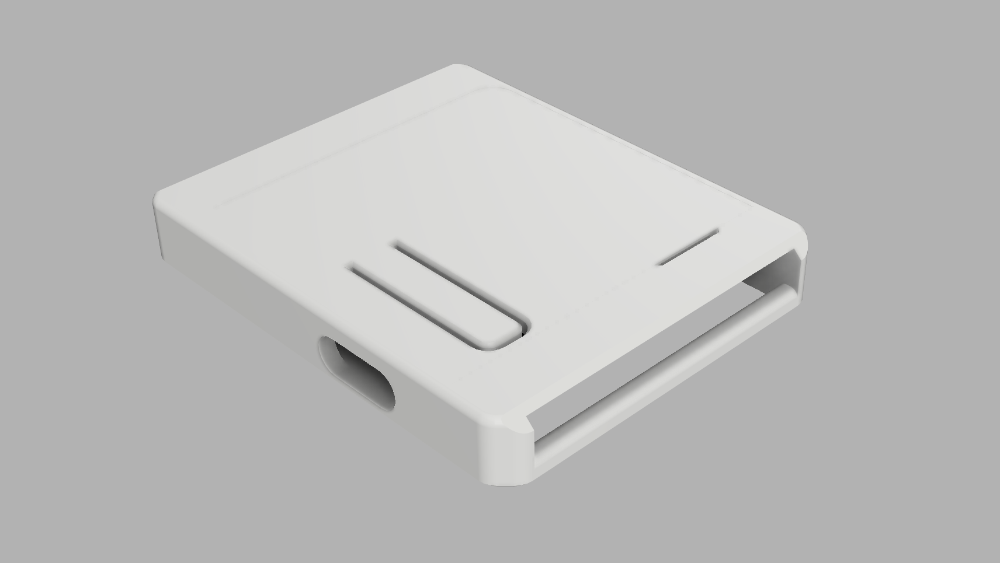
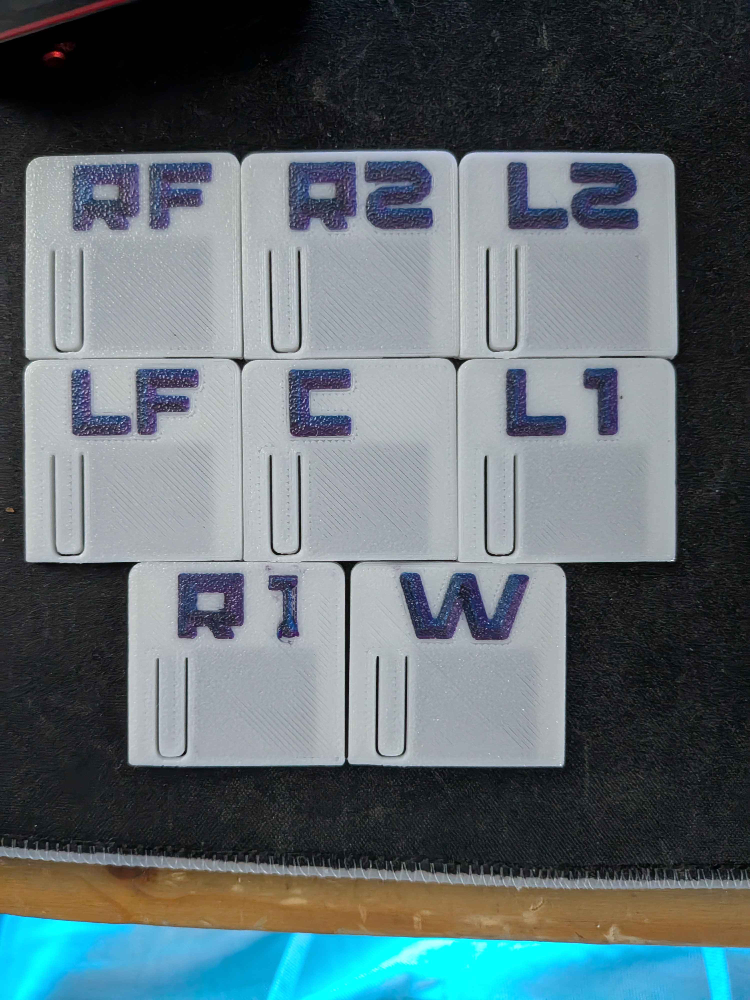
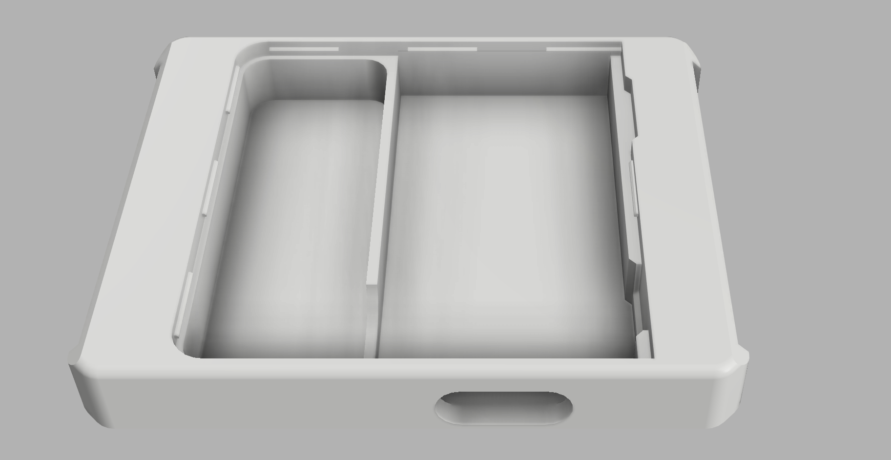
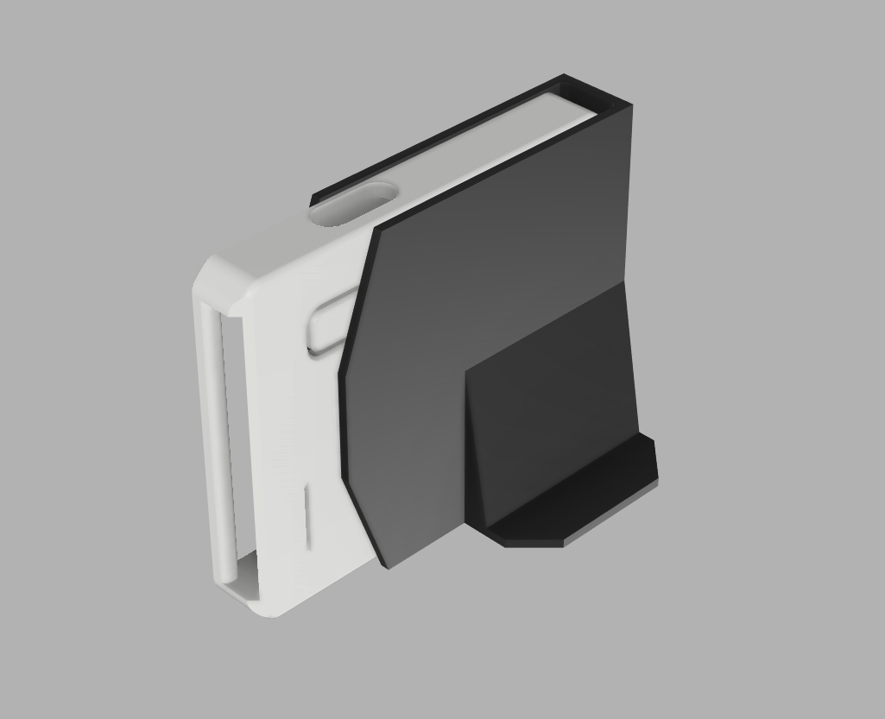

# SlimeVR-Kraft

A custom 3D printed case design for SlimeVR trackers, featuring a comprehensive set of covers for various body parts and a dedicated calibration station.

### Recommended Components

| Component | Variation | Link |
| :--- | :--- | :--- |
| nRF52840 SuperMini/ProMicro | N/A | [https://www.aliexpress.com/item/1005007738886550.html?mp=1](https://www.aliexpress.com/item/1005007738886550.html?mp=1) |
| Tactile Button 3X4X2MM SMD 2-PIN | N/A | [https://www.aliexpress.com/item/1005007004194449.html?mp=1](https://www.aliexpress.com/item/1005007004194449.html?mp=1) |
| 401230 3.7V 110mAh Battery | L0110 | [https://www.aliexpress.com/item/714331867.html?mp=1](https://www.aliexpress.com/item/714331867.html?mp=1) |
| IMU of Choice(Refer to Smol Documentation for compatibility) | N/A | [https://docs.shinebright.dev/diy/smol-slime.html#tracker](https://docs.shinebright.dev/diy/smol-slime.html#tracker) |
| nRF52840 Dongle (eByte(E104-BT5040U) or Nordic Semiconductor(PCA10059) or SuperMini) | N/A | N/A |
| VyroVR Straps | N/A | [https://vyrovr.com/ibis-tracker-straps/](https://vyrovr.com/ibis-tracker-straps/) |

> **Important**
>
> Purchase 30% more boards than needed to avoid extra shipping costs and time waiting on Dead on Arrival or boards that get damaged from assembly or soldering.

## Files Included

The project contains `.step` files for modification and printing:

*   **Calibration Station**: `src/calibration station/calibration station.step`
*   **Main Case**: `src/case/case.step`
*   **Covers**: `src/covers/`
    *   **Torso**: Waist (`caseW`), Chest (`caseC`)
    *   **Left Side**: `caseL1`, `caseL2`, Arm (`caseLA`), Foot (`caseLF`)
    *   **Right Side**: `caseR1`, `caseR2`, Arm (`caseRA`), Foot (`caseRF`)

### Case Markings

The case models feature embedded letter codes to identify their intended body position:

*   **C** — Chest
*   **W** — Waist
*   **L1 / R1** — Thighs
*   **L2 / R2** — Calves
*   **LF / RF** — Feet
*   **LA / RA** — Arms

## Photos

*Overview of all covers*

*Internal view of the case*

*Calibration Station*

## Credit

| Contributor | Description | Link |
| :--- | :--- | :--- |
| SlimeVR Team | Everything SlimeVR | [https://github.com/SlimeVR](https://github.com/SlimeVR) |
| Sctanf | Smol-Slime Firmware and Hardware design. | [https://github.com/SlimeVR/SlimeVR-Tracker-nRF](https://github.com/SlimeVR/SlimeVR-Tracker-nRF) |
| ShineBrightMeow | Smol-Slime Documentation | [https://docs.shinebright.dev/diy/smol-slime.html](https://docs.shinebright.dev/diy/smol-slime.html) |
| LyallUlric | Contributions to the stacked smol-slime branch. | [https://github.com/LyallUlric/Stacked-SmolSlime](https://github.com/LyallUlric/Stacked-SmolSlime) |
